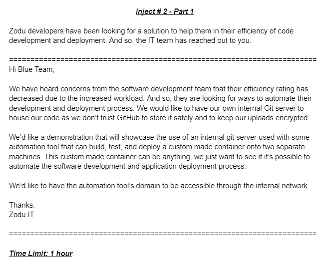
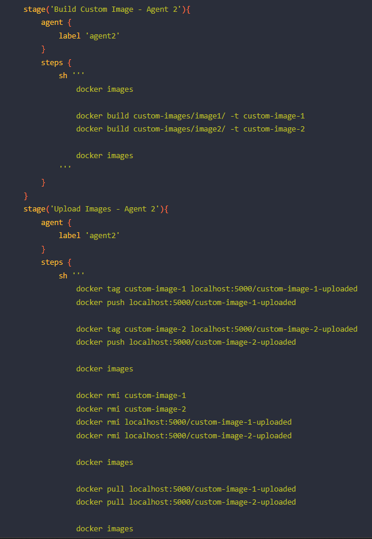
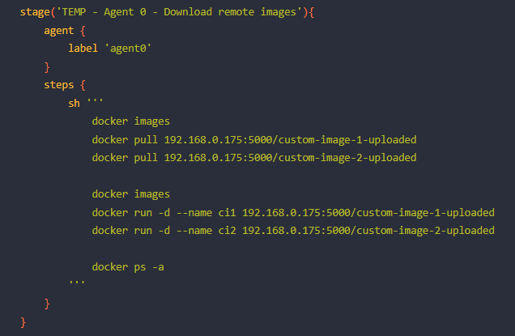
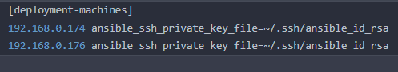
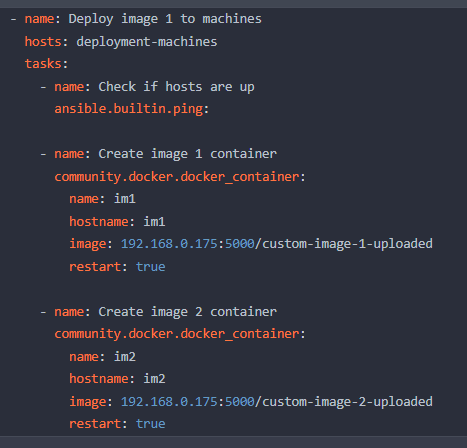
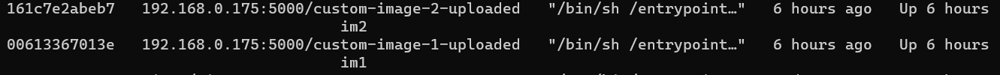
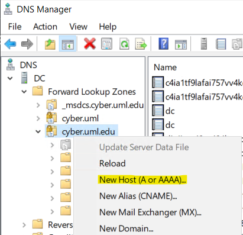
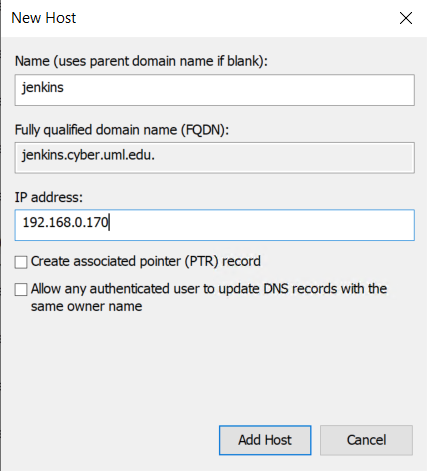
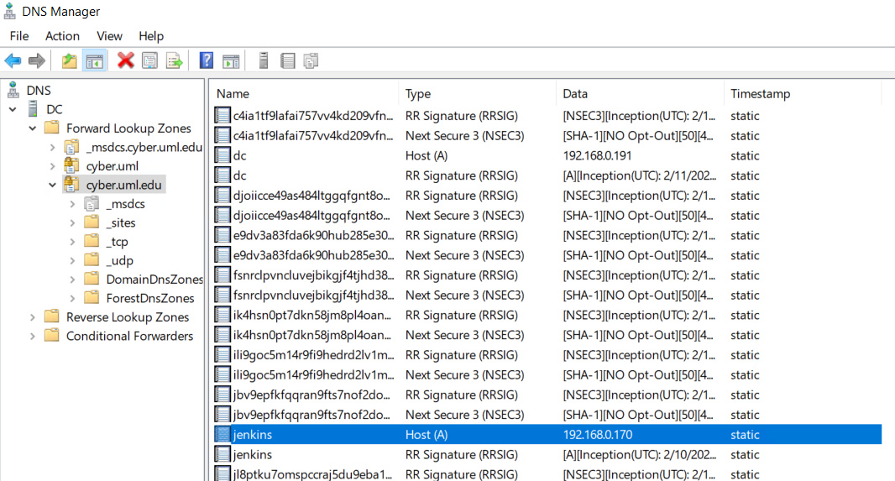
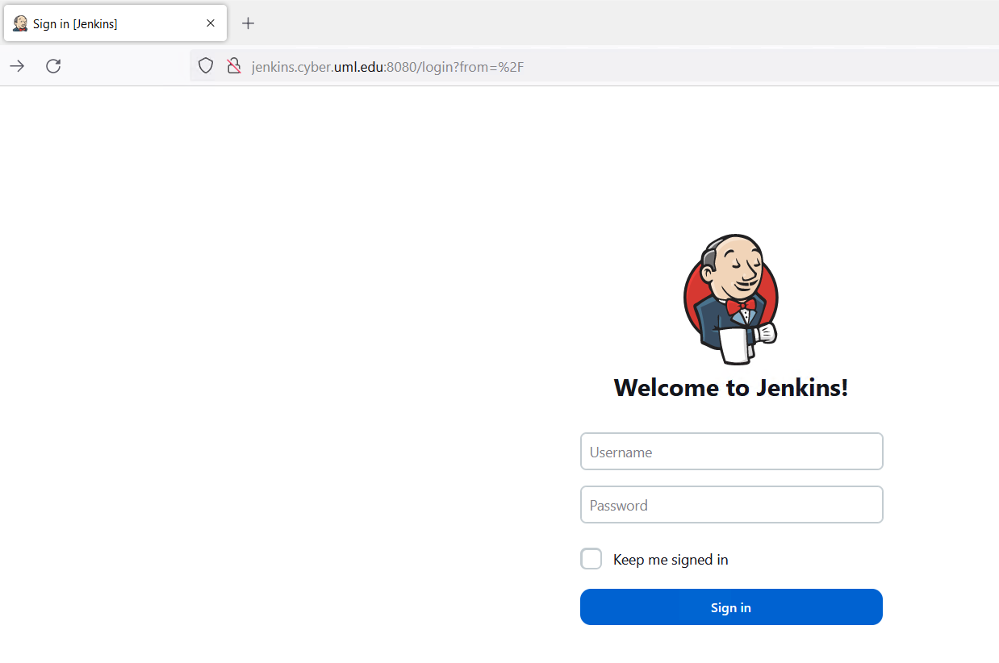

# **Inject 2 Part 1 Walkthrough**

This guide will be used to provide a walkthrough for Inject 2 Part 1 in an **insecure manner**. This should only be used as a last resort when the team could not fully complete the task in a reasonable amount of time.

# **Table of Contents**
- [**Inject 2 Part 1 Walkthrough**](#inject-2-part-1-walkthrough)
- [**Table of Contents**](#table-of-contents)
  - [**Prompt**](#prompt)
  - [**Requirements of the task**](#requirements-of-the-task)
  - [**Infrastructure Diagram**](#infrastructure-diagram)
  - [**Walkthrough**](#walkthrough)
    - [**Custom Docker Images**](#custom-docker-images)
    - [**Connecting Jenkins to the INSECURE Registry V2**](#connecting-jenkins-to-the-insecure-registry-v2)
    - [**Updating Jenkinsfile**](#updating-jenkinsfile)
    - [**Ansible Deployment**](#ansible-deployment)
    - [**Internal Domain**](#internal-domain)

## **Prompt**

## **Requirements of the task**
There were various portions to this task that require collaboration between team members for the sake of the end goal. I will try to create a coherent set of steps for each portion. But for now, there needs to be a direction for each of the injects. 

1. First off, we need an internal Git server on our network.
   1. Later stages would be to encrypt communications, but for now, keep it basic. Unless you have a complete guide that will allow you to make it secure from the get go.
2. "Automation tool that can build, test and deploy..." - This is textbook **Jenkins**.
   1. There are many steps that are needed in here, I'll explain them in the Jenkins section that is coming up.
3. "Custom made container..." - Sounds like a Dockerfile will need to be made. It can be stored on the Git server to be used by Jenkins during deployment.
4. "Two separate machines" - There's various ways that we can take this. We can do ssh commands into the different agent, we can have a machine that has Ansible insalled to create the infrastructure on other machines, or we could do a docker-compose file.'
5. "Automation tool's domain to be accessible through the internal network". This can be done through a DNS entry that points to our Jenkins Server.

## **Infrastructure Diagram**

## **Walkthrough**
I will use premade guides to give you guidance on some of the portions for this task.

[Git Server Creation](/containers/gitea/README.md) - This guide was made by Rose which will create a git server ready for use.

[Jenkins Installation - EC2](/jenkins/EC2%20Jenkins%20Server%20Installation/README.md) - This guide was made by Chris. It goes through the process of creating EC2 machines on AWS and then installing a Jenkins Server onto one of them. Once that is done, then an agent will be registered onto the server for use in a Jenkinsfile. You can skip to the `Registering Agents` section within this guide to understand how to properly add a node into your server.

### **Custom Docker Images**
The prompt did not say how to customize these images. We can just write two custom images for deployment.
1. Image 1 - This is an image that contains various text editors such as vim, nano and emacs.
2. Image 2 - This is simply an image that contains vim.

Both of these have an entrypoint script that will keep the containers alive. These can be found in ../Custom-Images.

[Registry V2 Creation](/containers/Registry%20V2/README.md) - Use this with care. It's **INSECURE**. This is simply to get the registry up so Jenkins can push to it. There are more steps that I'll explain next.

### **Connecting Jenkins to the INSECURE Registry V2**
In the infrastructure diagram above, you can see that there are 2 deployment machines per the prompt. However, Docker tries to include some security when contacting registries that download images. You will notice that there is an error when you try to pull the image from our internal registry.

*Note: This pull was done from a completely different machine. This is to showcase this error. Localhost wouldn't have this problem.*

To fix this problem, we will need to add an extra setting in the Docker daemon file to allow this connection. This can be found in `/etc/docker/daemon.json`. You may need to create this file.

The file will look like:

Replace the IP with whatever you need. Now, you need to **restart the Docker service** for it to take effect.

Ideally you just put the certs that are needed. But, if you absolutely cannot, then this is how you will get the end product done in an insecure way.

Whoever needs to use this registry will need to have this fix implemented for them.

### **Updating Jenkinsfile**
Now, we need to try and automate the building stage on the agents now. This is not the final Jenkinsfile. But it's close to it.

These two images showcase a Jenkinsfile that will build the image on agent2 and then push it to the registry contained on agent2's machine. Finally, it will try to pull the image from our interal registry and spin up a container using those images.

### **Ansible Deployment**
Next, this is where the deployment onto the other machines will be done. This step could be done in many ways, but to showcase the ease of integrating the automation tools together to do greater things.

And so, I wrote an ansible script to deploy these machines on different hosts.

The files look as follows:

**Inventory File**

**Ansible Playbook**

The playbook simply just spins up two docker containers *not* on their own network. To follow what was asked, this is all this is needed as proof.

We can confirm that the containers were made by looking on the deployment machines. I only show one in the guide, but in a write-up you want both. And you want the command line to show the hostname.

Upon further inspection, you can simply type `vim`, `emacs` and `nano` on each machine and confirm that the expected editors from the Dockerfile are present and nothing else.

### **Internal Domain**
The final part of the inject is to have the "automation tool" accessible through a Domain(Jenkins). 

*This guide assumes that you already have a working DC DNS instance with a domain already installed. I will simply be showing you how to add the domain to the DNS.*

1. First thing to do is to add to add a new host into the overall domain.

2. Now, we just fill in the dialog box with the information that we desire.

3. Now, we have a complete entry inside the forward lookup zone.

4. If we go into a web browser that has our internal DNS as a DNS server and use "jenkins.cyber.uml.edu" and using the default Jenkins port 8080, we will be able to access it.

