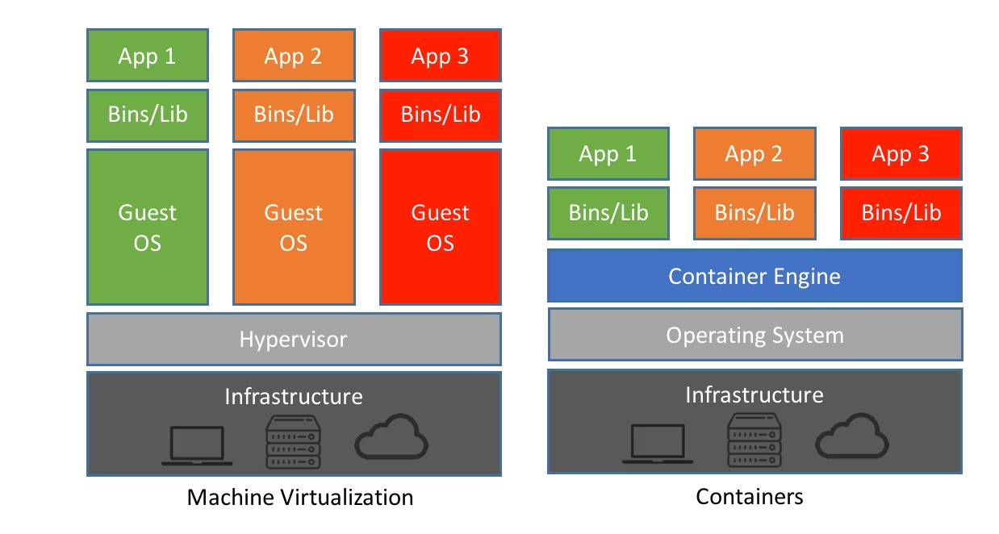

# Presentation of Containers, Docker and basics of securing individual containers

This is atleast planned to be a presentation on what a container is (the basic difference between a container and a VM), a short demo to show what namespaces are using unshare since namespaces are the main thing that provides isolation for containers, and the basics of securing an individual container.

Note: this does not go into Container Orchestration, as  most of what you do and apply to individual containers appears to be what you do to the containers in a docker swarm or kubernetes cluster (or the pods within the cluster). also I am not too familiar or confident with going over orchestration yet…

## Container vs VM, what are Containers
If you have ever looked into “what is a Container” you will have seen the following image 

On the left is a representation of what a VM is and on the right a Container, it just so happens the image I stole represents a Type 1 hypervisor for the VM’s but the principle is the same regardless of what type of Hypervisor is used, it only changes the number of layers between the Guest Operating system and the underlying hardware. 

Containers are often compared to VMs and people do often say they are like a lightweight VM and although this is true it may be a little misleading

### Containers
They are not implemented in the same way as the VMs, they are really just isolated processes that run on the host machine, as they use the host kennel and underlying hardware for all system calls, scheduling, and execution. This is unlike a VM which has it s own kennel for the execution of system calls.  This means a method of implementation like on the left  with the hypervisor where the container engine takes the place of the Host OS is not possible, however there are Operating Systems that are specifically designed to run containers as they are often small, lightweight and have limited functionality they are often Operating systems designed to run on cloud platforms. Since containers run as isolated processes they can only run programs that can run…. well…. on the host system, with Docker this gets a little odd and ill get more into that later.

Containers are implemented using some features of the kennel, specifically namespaces and cgroups; this means if an operating system does not support these features, it will not be able to run containers.

Also if you have ever used VMs which I assume is likely you would have noticed it will take awhile for them to “turn on” and get started, this is because they have to boot their own kennel. If you have ever used a container you would have noticed this is not the case for them as they used the host kennel and as they are just isolated processes, the time it takes to start them is just the time it takes to start a process.

On that note since they are just isolated processes running on the host, it is easy for each container to scale to the resources it needs, being cpu, memory, etc. As unless a limit is placed on a process it will attempt to take as much as it needs. (Google chrome and other browsers with the hippity hoppity your ram is now my property)

## Namespaces and cgroups
### Namespaces
These are the main things that I want to talk about as they are pretty easy to do a demo on, and they are what make containers containers, not just a metered process. 

Namespaces are what provide the isolation that make containers containers. There are many kinds of namespaces and I am not going to go over all of them, so they are probably a bit more important than others. Also for the demo I cannot easily demonstrate most of them…

**There are __ namespaces**
The key ones for the demo are
Pid namespace: the pid namespace provides process isolation, in that it isolates the process from the other processes running on the system that are not in the same or descendant namespaces, it does not separate the process from the other parts of the system such as the file system, network ect. The first process in the PID namespace will have a PID of 1, which can complicate things for programs looking for systemd

#### **Mount namespace**
The mount namespace isolates process mounts or filesystems 

#### **User namespace**
The user namespace allows for user mapping, where a process can thing it is running as root, however in the root namespace it is running as some other non-root user

#### The others are
UTC namespace: Not mentioned but allows the host and domain name to appear different for different processes 
IPC namespace: This one allows each process to have isolated IPC resources (semaphores message queues etc.)
Network Namespace: allows isolated processes to have their own separate network stack resources (IP, routing firewall etc…) 

The demo will be using unshare and will use the first 3 namespaces mentions and may help clarify how containers are actually running on the host system.

### cgroups
There will be no demo for this, however if you want you can easily find one online. 

What are they? cgroups are also known as control groups and they are used to control the resources that a process can use, there are quite a number of them and they can limit or control quite a number of things, common ones such as the total system cpu or memory usage to a more obscure thing like what specific cpu the process can run on. [this is a man page on it](https://manpages.ubuntu.com/manpages/bionic/man7/cgroups.7.html)

I wont be going into much detail on them as they just limit various resources on the host system on a process by process (and child processes spawned by those) basis.

### Demo
This is where I do unshare a lot and take up a good amount of time….
Since I don't want to type it all out here is a video showing presumably what I did, but better then what I likely did: [ref](https://www.youtube.com/watch?v=J17rXQ5XkDE&feature=youtu.be)

Interesting note on ps command is that it reads the /proc directory to gather information on the running processes, sp when creating the pid namespace if you do not use the --mount-proc flag it will appear as though the processes were not isolated, however if you attempt to interact with any processes outside of the namespace it will not work and will say those processes do not exist.

There is support for up to 32 nested namespaces, [source](https://man7.org/linux/man-pages/man7/pid_namespaces.7.html#:~:text=Since%20Linux%203.7%2C%20the%20kernel,for%20PID%20namespaces%20to%2032.). I don't know why you would want that many but it is an option!

## Docker basics:
Dockerfile, this is a basic file which instructs docker how to build the images, that the container will be run off of. An image is essentially a blueprint of what the container will be, and it is a separate entity from the actual containers. If you make changes in a container and it is killed, (not stopped) they will not be persistent. when you start a new container it builds off of the blueprint which will not change, not the last or most recent instance of the container.

### Commands
`docker images`: lists images on the machine

`docker image rm <image name/ID>`: removes the image

`docker ps`: lists running containers

`docker ps -a`: lists all containers on the machine

`docker run <options> <name of image>`: creates a new instance and runs the new container

`docker stop <Name/ID>`: stops a running containers

`docker start <name/ID>`: starts a stopped container

In addition to those commands there are many others where you can create new networks, volumes and more.

The next part is on the docker run command specifically and what you can do there to make a container more secure, as probably mentioned earlier I am not going to go into securing them when using an orchestration software such as Kubernetes or Docker Swarm but the ideas are similar, the only difference is where and what you write.

### Docker Run: [more](https://docs.docker.com/engine/reference/run/)
To start off with some basic flags that may make your life a bit easier when playing around with Docker

The `--rm` flag, this flag will remove the created container once it is stopped. This is more useful when testing as it prevents your system from getting clutter with old containers.

The `-i` and `-t` flag often written as -it or -ti. The -i flag is for interactive and the -t flag is tty, when they are combined they allow for terminal access to the container. If they are not included you cannot interact with our use a terminal in the container.

the `--name <somename>` flag is not necessary, but when you are making a container, it needs a name, if one is not provided with this flag then a random two word name is given.

Those namespaces I mentioned before, if you want you can attach the container to a different namespace using --<namespaceType>=<namespace> an example they give is --pid=host.

you can also using the `-a` flag attach the stdin/out/err of the container to the hosts with -a=STDIN

### Network
There are a large amount of network flags, to control everything from the ipv4 or 6 address tothe mac address of the container. I am going to mention the two that may come up more often 

`--network=<network>` docker has a group of basic networks, by default they will use bridged but if you want to change the network you can use this flag 

`--network-alias=<alias>` docker has its own internal DNS like service where you can give containers a alias, and in a program look up that container by that alias rather than its IP address, this is useful as we don't know what IP address will be assigned when containers are created and destroyed, something like this will come into play when container orchestration is considered as the containers over time will be created and destroyed.

`-p <host port>:<docker port>` this will map/port forward the host port to docker and vice versa 
Note on that most things that involve a mapping of host to container are <host thing>:<container thing>

### Storage
Volumes with the `-v <named/pathonhost>:<pathOnContainer>` there are named volumes which can be created through use of the docker volume create, however if one is not already created and you have -v named:pathOnContainer then one will be created using default options. Another option is to specify a path on the host which will use a shared memory instead. If you are developing a program in a container a possible use is to store it in the volume, and use a program that is running in the container to restart the one you are developing whenever changes are detected in the source file. This means you don't have to rebuild or restart the container when any changes are made.

Volumes are more often used, however you can use the --mount --type=<type> --source=<path> --target=<pathOnContainer> to create other types of mounts (tmpfs is also possible

-tmpfs=pathOnContainer this will make a temporary writable filesystem on the container, when the entire container is read only this will be writable

### [Resources](https://docs.docker.com/config/containers/resource_constraints/)
`--cpus=”%ofCPUonsys”` limits the total% of cpu usage on sys (1.5 total use of 1.5 cpus) 
--cpuset-cpus=0,1,2,... this limits what cpu the container can run on (remember that cgroup cpuset mentioned earlier)
--memory=%ofsys limits the total memory usage (ram) of the container in relation to all available on the system 
 There are many more 
an odd one I found is --memory-swappiness="0-100" Which controls how swappie the memory is… funny words 

### Security
The docker demon and platform itself is quite secure, the main challenge is configuring the containers correctly to prevent escape if a container’s app is breached. Most of this revolves around protecting the kernel capabilities available to the container as those are the only way it can access and exploit the host system to escape.

`--read-only` this makes the whole file system of the container read only, you can make portions writable if an app needs it with the -tmpfs or --mount --type=tmpfs --target=path flag, Note on windows and mac the -tmpfs flag does not work

`--cap-drop=all` this will drop all kernel capabilities that a container has, this is recommended action on all containers 

`--cap-add=cap1 cap2 cap…` this will add kernel capabilities to a container 

`--privileged` just never use this unless it is specified a necessary to a container running, if the application in the container is exploited it is almost guaranteed that whoever is in the container will be able to escape unless other security measures are in place.

`--security-opt=<OPtion>`
    --security-opt=apparmor=Profile applies a apparmor profile to the container 
    --security-opt=seccomp=Profile applies a seccomp profile to the container 
    --security-opt=no-new-privileges:true prevents the container processes from gaining
    privileges

`-u <uid or user>` flag this could be placed in earlier sections like “basics” but containers will inside (as well as outside) run as root, so if you make the application run as an unprivileged user, then it is that much harder(like in any linux system) to exploit it and escape.

I briefly mentioned in the -u flag explanation that the processes in the container runs as root outside, this is because by default the containers dont use user namespace mapping, you should enable it where possible. But do note any containers created before the mapping is enable will be inaccessible after. See [this](https://docs.docker.com/engine/security/userns-remap/) for more detail.

## Apparmor and seccomp:

I will not go into much detail on these as the could probably be a topic all on their own, and I am not to familiar or comfortable with them so that would complicate me going into detail on them…

Apparmor is the debian based systems mandatory access controls, these are well mandatory and are applied to individual processes, and sometimes the child processes spawned from them. 

Apparmor has its own syntax and file structure, luckily for us there are a large number of profiles that are already made for many applications, as it is quite a tedious process to make a profile. [ref](https://ubuntu.com/tutorials/beginning-apparmor-profile-development#1-overview) There are tools created to make it easier but it is still a slog. First you create a basic default profile for the application, you can download a simple tool to do that for you with apparmor-easyprof. The next thing you do is set the profile to complain mode, they are deny be default, and in complain mode will log all failures. The next thing you do is run the desired application. After that you read the logs wherever they are stored (syslog, auditlog ect), the tool apparmor-notify and aa-logprof from aa-utils to build out the profile more easily. after that you hand edit them

The main point of this will look at the controls that apparmor provides by looking at example profiles.

Seccomp allows us to control what linux system calls a process can make, the profiles are written in a json format and it is relatively simple, you can set the default to deny and this is the best option. you then specify only those system calls that the process needs. Again this is a tedious process where you look at the system calls a program uses when running using a program like strace. [there are ways of isolating unique syscall](https://stackoverflow.com/questions/10584702/extracting-unique-syscall-names-from-strace-output-via-regex), again I will not be going into detail just show the default one on the docker website.

 

