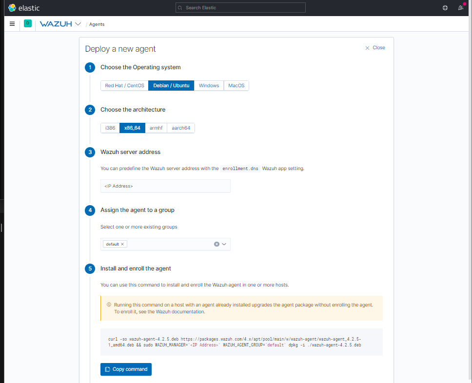
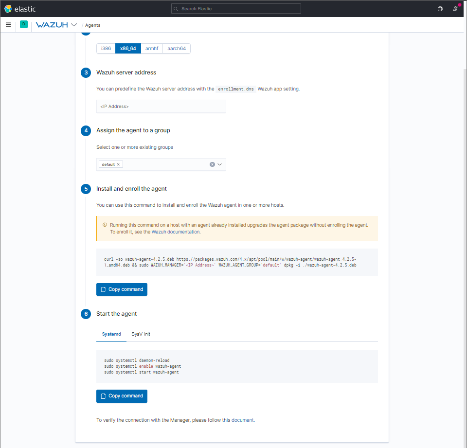
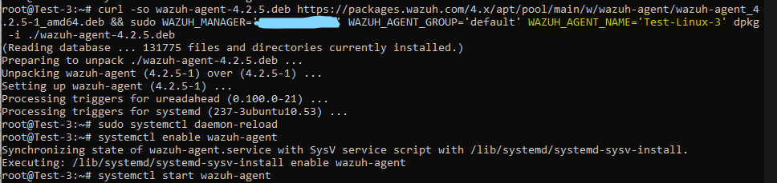

# Wazuh Agent Installation Guide - LINUX (Debian/Ubuntu)

Installing a Wazuh Agent on an Ubuntu machine is pretty simple.


## ELK Stack Side (SOC)
 
You can find the correctly formatted command from the UI of the ELK stack Wazuh-Plugin

1. Choose "Debian/Ubuntu" as the OS (Or appropriate linux flavor)

2. Choose "x86_64" as the architecture (Find which is the applicable OS with the command ```uname -m```)

3. Type in the Wazuh server address replacing <IP Address>

4. Assign the agent to a predefined group in the dropdown menu

5. Now, the command to install and enroll the agent will pop up with the specified information. 
   All the user has to do is input this command and the installation will be complete.

   **SEND THIS COMMAND OVER TO THE PERSON REGISTERING THE USER**

6. Finally, the agent must be started on the client machine. (Refer to the Endpoint User Guide Below)

### Sample






## Endpoint User Side (Both NOC/SOC)

From part 5 and 6 from the ELK Stack Side (SOC) section above, the user doesn't have to do much to register the user. However, you **MUST** let the SOC team know that you are registering a new agent. 

1. Let the SOC team know that you're registering a new agent.

2. Get the correct command from the SOC team (unless otherwise told that it's ok to use this guide as a reference)

3. Run the command given. Refer to the sample below for the format.


   **Note: Make sure to give a name to your agent to make it easier to see who we're monitoring :)**
   
   _You can do this by adding this before the -i flag, after the various WAZUH specifications. "      WAZUH_AGENT_NAME='INSERT_NAME_HERE'    " (Include the single quotes, not double)_


4. Start the agent on the machine.

```
sudo systemctl daemon-reload
sudo systemctl enable wazuh-agent
sudo systemctl start wazuh-agent
```

### Sample




**Note: Linux Hardening Script may remove the functionality. Make sure to allow port 1514 outgoing through ufw**


That's it. Your machine is now registered.

